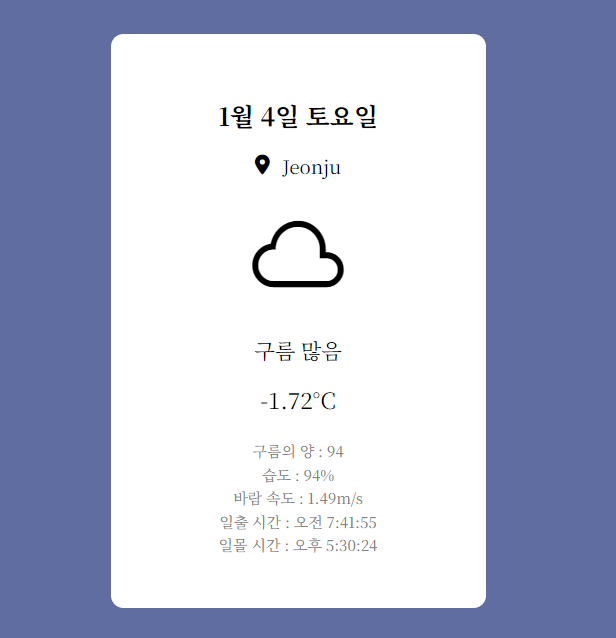

## 프로젝트명 [ 실시간 날씨 ⛅]

  

## 프로젝트 설명
이 프로젝트는 OpenWeather API를 이용해서 사용자의 현재위치를 기반으로 최신 날씨정보를 가져오고, 기온 / 날씨상태 / 구름의 양 / 습도 / 바람속도 / 일출 및 일몰시간 등을 확인 할 수 있으며, 날씨 이모티콘과 날씨 상태를 알려주는 텍스트를 통해 사용자가 쉽게 이해할 수 있도록 구성된 웹 어플리케이션 입니다.

## 프로젝트 링크
[ 실시간 날씨 ⛅](https://weather-project-peach-xi.vercel.app/)

## 개발자
최지영

## 개발 기간
2024.12.29 ~ 2025.01.04

## 주요 기능
### 1. 실시간 날씨 정보 표시
사용자의 위치를 통해 실시간 날씨정보를 표시합니다. openWeather API를 통해 얻은 날씨 상태코드(ex.800은 맑음)에 맞게 날씨 이모티콘을 표시하고, 사용자가 쉽게 이해할 수 있도록 적절한 텍스트(ex. 맑음)도 보여줍니다.

### 2. 기온 이외의 상세정보 표시
사용자가 기온 이외에도 다양한 정보를 얻을 수 있도록 구름의 양, 습도, 바람의 속도 등의 정보를 확인 할 수 있습니다.

### 3. API 키 보안 유지
API키를 외부에 노출되지 않도록 환경변수로 관리하며, .gitignore파일을 통해 github에 업로드 되지 않도록 하였습니다.

### 4. Node.js로 서버구축
실시간 날씨정보 제공을 위해 비동기 데이터 처리, API연동 등을 위해 node.js와 Express.js를 사용하여 서버를 구축 하였습니다.

### 5. vercel 배포
백엔드가 포함된 페이지를 배포하기 위해 Vercel을 사용하여 배포를 완료했습니다.

## 기술 스택
HTML / CSS / JavaScript / Node.js / OpenWeather API / Express.js / Geolocation API / Axios / dotenv
* OpenWeather API : 실시간 날씨를 받기 위해 사용한 외부API
* Express.js : 서버생성 및 api 요청처리
* Geolocation API : 사용자의 위치 정보 자동감지
* Axios : API요청을 위한 HTTP 클라이언트
* dotenv : API 키관리를 위한 환경변수 설정

## 개선할 점 및 추가하고 싶은 기능
1. 애니메이션 효과 : 날씨 정보 변경될때 부드러운 효과 주기
2. 하루동안의 기온중 최저기온 및 최고기온 표시
3. 구름의 양은 최저와 최고 표시하기 (1~100 이런식으로)
4. 아이폰에서 위치정보 허용 묻지않아서 날씨api를 불러오지 않는 문제 해결하기
